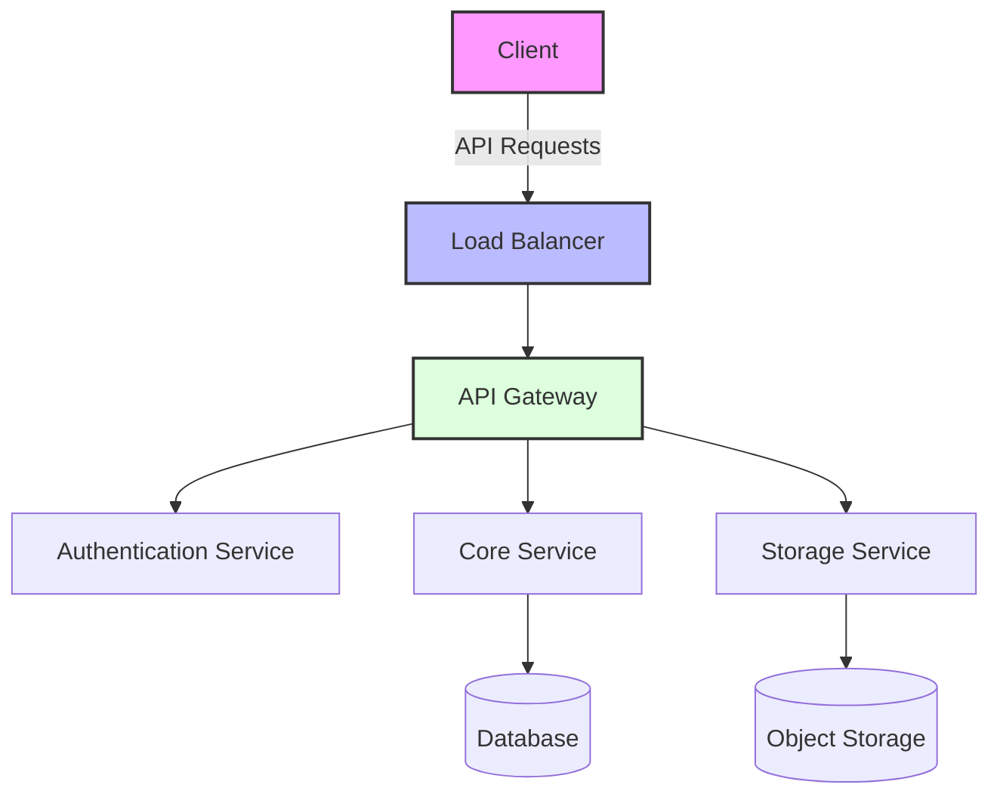

# 🚀 Project Awesome

An innovative solution for making your development workflow more efficient and enjoyable.

## 🌟 Features

Our platform offers a wide range of capabilities to enhance your development experience:

### 🔥 Real-time Collaboration

Work together seamlessly with your team members in real-time.

## 📦 Installation

Getting started is quick and easy:

```bash
npm install project-awesome
yarn add project-awesome
pnpm add project-awesome
```

## 🛠️ Configuration

### ⚙️ Basic Setup

Configure your environment variables and get started in minutes.

### 🔒 Security Settings

Implement robust security measures with our built-in tools.

## 🔧 Usage

Here's a quick comparison of our different pricing tiers:

| Feature        | Free      | Pro   | Enterprise |
| -------------- | --------- | ----- | ---------- |
| Users          | 5         | 50    | Unlimited  |
| Storage        | 10GB      | 100GB | 1TB        |
| Support        | Community | 24/7  | Dedicated  |
| Custom Domains | ❌        | ✅    | ✅         |

## 📝 Example Content Types

### Code Blocks with Syntax Highlighting

```typescript
interface User {
  id: string
  name: string
  role: 'admin' | 'user'
}
```

### Blockquotes

> Project Awesome makes development a breeze.
>
> -- _Happy Developer_

### Task Lists

- [x] Install Project Awesome
- [x] Configure environment
- [ ] Deploy to production
- [ ] Scale to millions of users

### Text Styling

This is **bold text**, this is _italic text_, and this is **_bold italic text_**.

### Badges

[](https://badge.fury.io/js/project-awesome)
[](https://travis-ci.org/username/project-awesome)
[](https://opensource.org/licenses/MIT)

### Inline Links and Images

Check out our [blog post](https://blog.project-awesome.com) about the latest features!
Here's our logo: 

## 🏗️ Architecture

Our system architecture is designed for scalability and performance:




## 🔗 Useful Links

- [Documentation](https://docs.project-awesome.com)
- [API Reference](https://api.project-awesome.com)
- [Community Forum](https://community.project-awesome.com)
- [Contributing Guidelines](https://github.com/project-awesome/contributing)
- [Security Policy](https://github.com/project-awesome/security)

---

Made with ❤️ by the Project Awesome Team
